# Metodología de Trabajo y Herramientas

Para el desarrollo, especificación y gestión de los requisitos del proyecto **«Ven al Centro y Gana»**, el equipo adoptó un marco de trabajo basado en **Scrum Híbrido**. Esta metodología combina la flexibilidad y adaptabilidad de los marcos ágiles con el rigor y la documentación estructurada de la ingeniería de software tradicional.

---

## 1. Marco de Trabajo: Scrum Híbrido

El uso de **Scrum Híbrido** nos permitió iterar rápidamente en la recolección de hallazgos de usabilidad y pruebas de campo, manteniendo al mismo tiempo una documentación formal y trazable de los Requisitos Funcionales (RF) y No Funcionales (RNF).

* **Sprints e Iteraciones:** Organización del trabajo en ciclos cortos de desarrollo para revisar hallazgos, maquetar prototipos de interfaz (UX/UI) y formalizar requisitos.
* **Sesiones de Alineación (Daily / Syncs):** Reuniones breves del equipo para coordinar la división de tareas, evaluar avances y resolver bloqueos en el análisis de las notas de campo.
* **Control de Cambios y Calidad:** Integración continua de mejoras a la documentación a través de revisiones de código y solicitudes de extracción (*Pull Requests*).

---

## 2. Ecosistema de Herramientas Tecnológicas

Para garantizar la colaboración fluida, la trazabilidad de los artefactos y el control de versiones, el equipo utilizó las siguientes herramientas:

| Herramienta | Categoría | Uso en el Proyecto |
| :--- | :--- | :--- |
| **Visual Studio Code** | Editor de Código | Redacción, estructuración y edición local de la documentación técnica en formato Markdown (`.md`). |
| **Git** | Control de Versiones | Gestión local de ramas (*branches*), registro de cambios (*commits*) y trazabilidad de modificaciones en la documentación. |
| **GitHub** | Repositorio Remoto | Alojamiento del proyecto, gestión de colaboraciones mediante *Pull Requests*, revisión de pares y vinculación con *Issues* (como el `#19`). |
| **GitHub Desktop** | Cliente Gráfico de Git | Sincronización visual y ágil entre el entorno local de trabajo y el repositorio remoto de la organización. |
| **DevTools (Navegador)** | Pruebas y Auditoría | Emulación de dispositivos móviles (360 px a 1024 px) y validación del tiempo de respuesta y carga del catálogo de sucursales. |
| **WebAIM Contrast Checker** | Evaluación UX/UI | Auditoría de accesibilidad para verificar las relaciones de contraste cromático (WCAG 2.1 AA) en la paleta oficial de la campaña. |

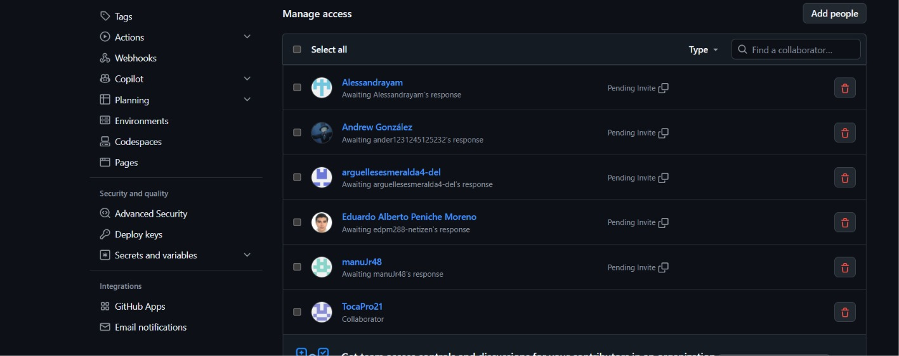 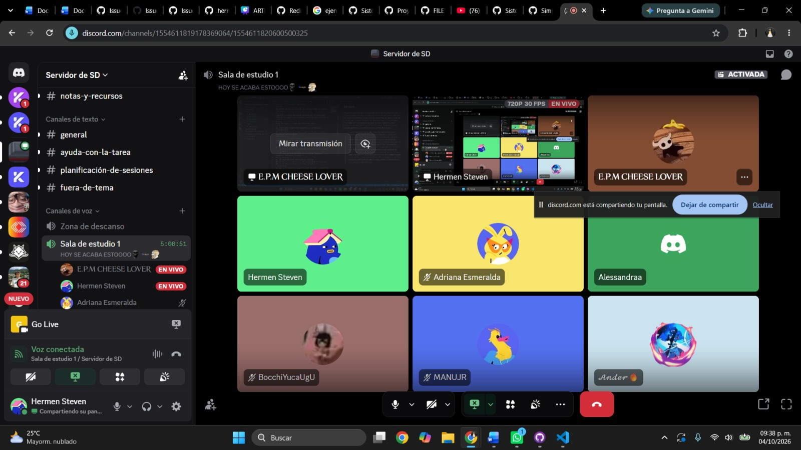 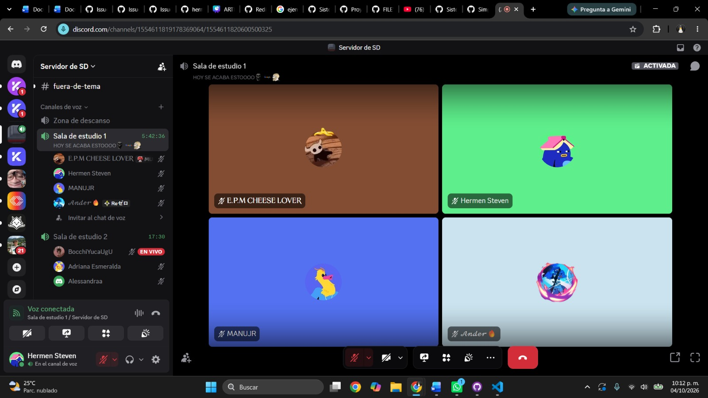 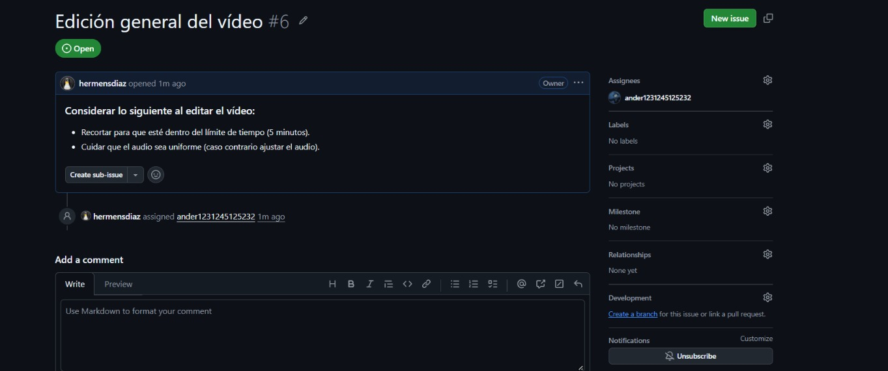 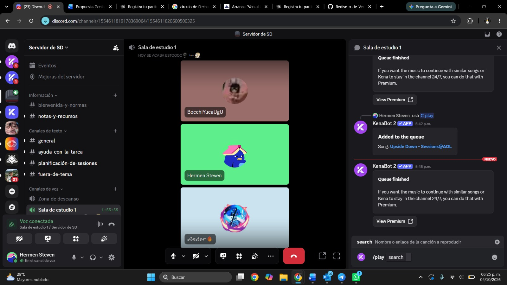 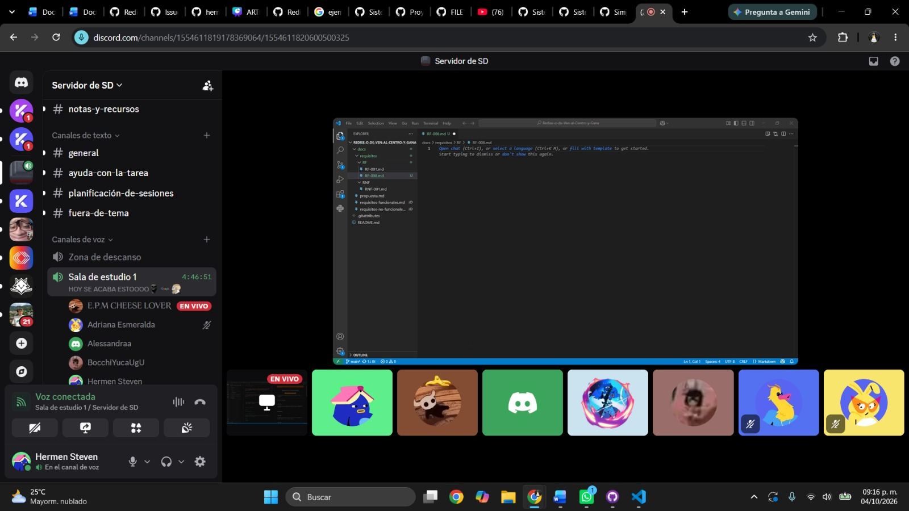 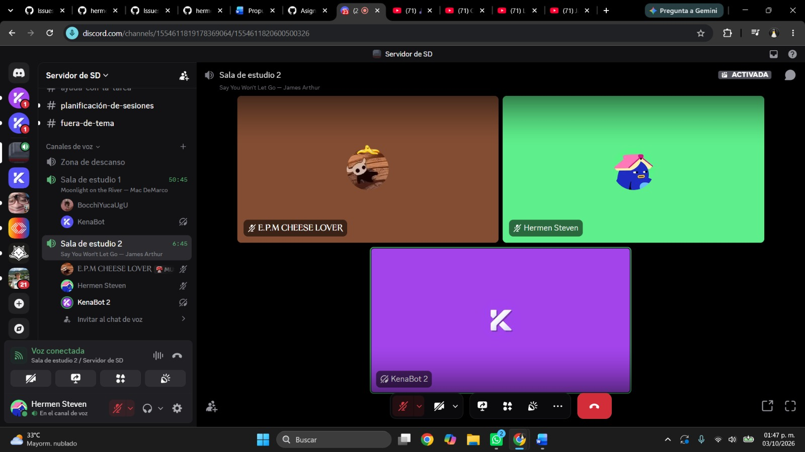 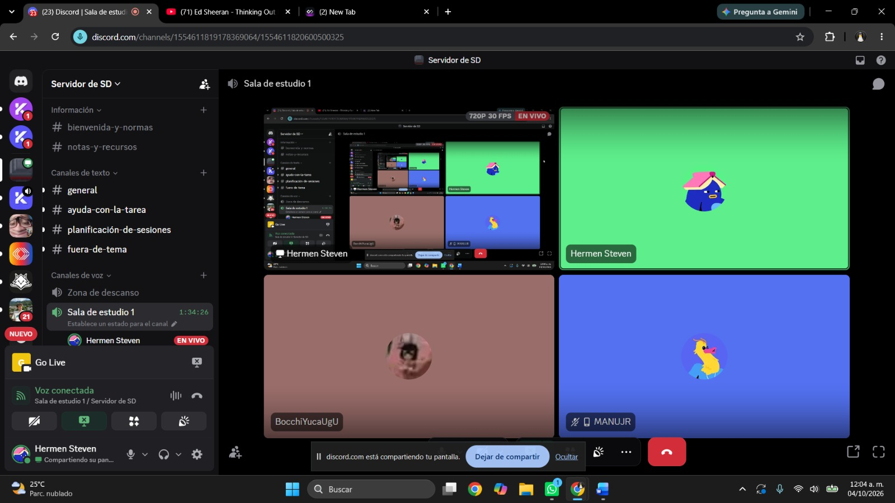 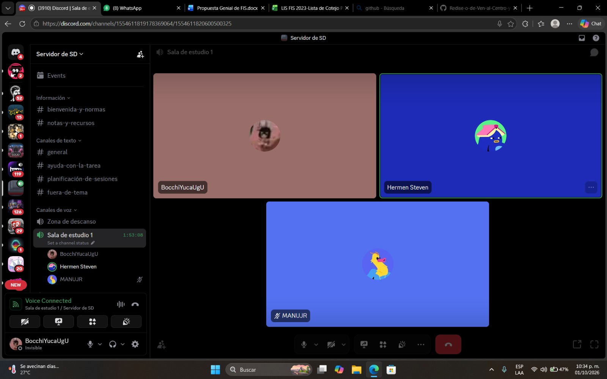 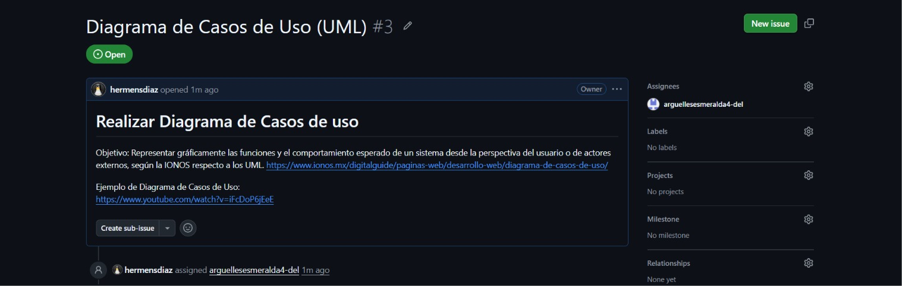 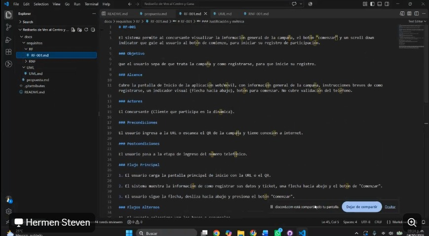 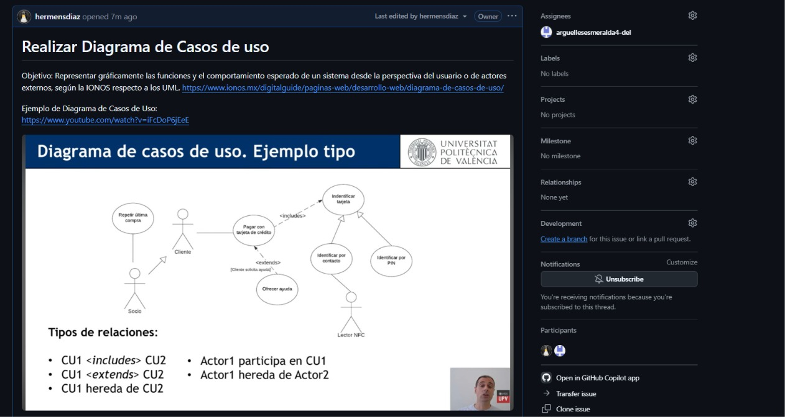 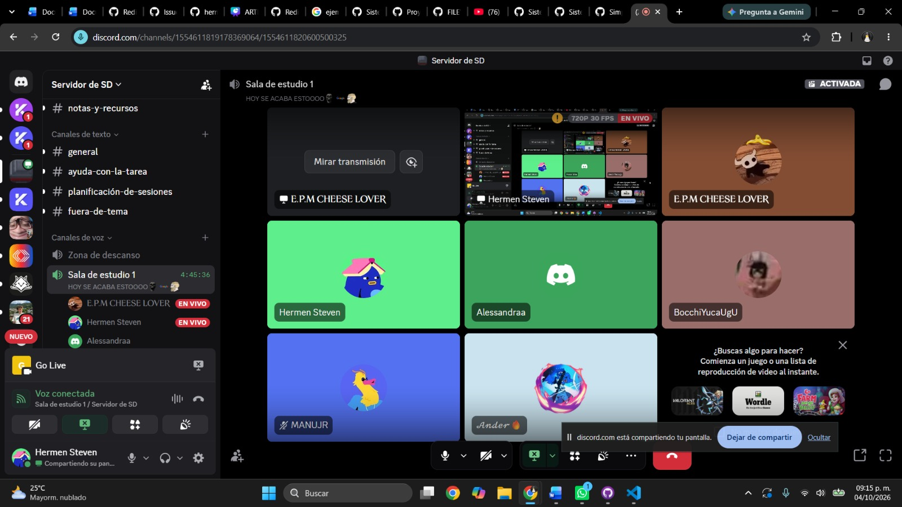 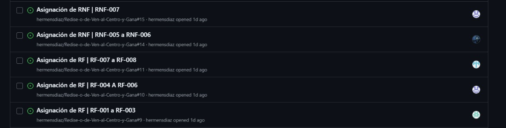   